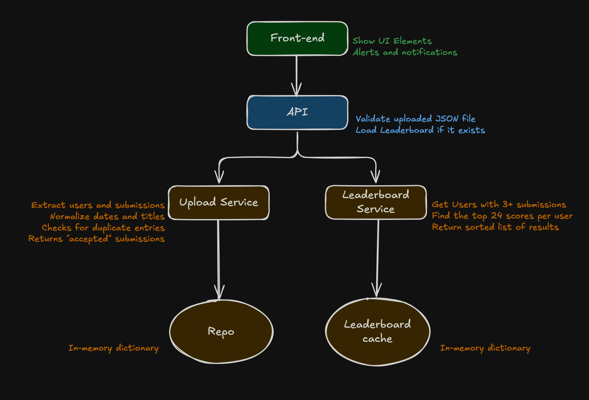

# Online Leaderboard App

This project implements an online leaderboard system where users can upload JSON files containing user submission scores.
The leaderboard is computed by aggregating each user’s best 24 submissions, and a user must have at least 3 to qualify.

## Features

- Upload `.json` files through a web interface
- Validates and processes submission data
- Leaderboard based on the sum of best 24 scores per user
- User detail pages showing all submissions
- In-memory storage for rapid development and testing
- Test coverage for core backend components
- GitHub Actions for continuous integration

## Technology Stack

- Backend: Python 3.11, Flask, Flask-CORS
- Testing: Pytest
- Frontend: React, TypeScript, Bootstrap
- Dev Tools: Shell scripts, GitHub Actions

## Architecture Overview



### Architecture Intent

This project was designed to reflect the serverless-first architecture style used at Perspectum. While it currently runs locally using Flask and in-memory services for simplicity, the structure allows for easy migration to a production-grade, AWS-based setup. Key migration targets include:

- **Flask → AWS Lambda** via tools like Zappa or AWS API Gateway integrations
- **Upload endpoint → API Gateway + Lambda**
- **In-memory queue → Amazon SQS (partitioned by user)**
- **Leaderboard computation → Lambda + cache store (e.g. Redis or DynamoDB)**
- **Persistent storage → DynamoDB or Aurora Serverless**
- **Static frontend → S3 + CloudFront**

This local mock setup provides a clean starting point while remaining faithful to the intended event-driven, serverless backend architecture.

## Setup Instructions

1. Clone the repository:

   ```bash
   git clone https://github.com/asandriss/leaderboard-app.git
   cd leaderboard-app
   ```
2. Set up and activate Python virtual environment:

    ```bash
    python3 -m venv .venv
    source .venv/bin/activate
    pip install -r requirements.txt
    ```
3. Start the application (FE & BE)

    ```bash
    ./start.sh
    ```

4. Open the application on <http://localhost:5173>

4a. Backend will be running on <http://localhost:5000> and can be tested via dev tools

5. To monitor backend logs in real time

    ```bash
    tail -f backend/server.log
    ```

## Testing
To run backend tests:
    ```bash
    pytest
    ```

Tests are also automatically run on every commit via GitHub Actions.

For manual testing two example JSON files are included with the files.

## Project Structure

```bash
├── backend/
│ ├── app.py                            # Main Flask application entrypoint
│ ├── models/
│ │ └── submission.py                   # Data model for a user submission (dataclass with validation)
│ ├── services/
│ │ ├── leaderboard_service.py          # Computes leaderboard rankings from stored submissions
│ │ ├── submission_repository.py        # In-memory repository for storing and querying submissions
│ │ └── upload_service.py               # Parses and validates uploaded JSON files
│ ├── tests/
│ │ ├── init.py                         # Marks tests as a package
│ │ ├── test_leaderboard_service.py     # Tests for leaderboard aggregation logic
│ │ ├── test_submission.py              # Tests for submission model validation
│ │ └── test_submission_repository.py   # Tests for repository behavior and deduplication
│ └── pytest.ini                        # Configures pytest to discover tests under backend/tests
├── frontend/
│ ├── index.html                        # HTML entrypoint for React frontend
│ ├── public/                           # Static assets (currently unused)
│ ├── src/
│ │ ├── App.tsx                         # Root component: handles layout and upload form
│ │ ├── Leaderboard.tsx                 # Displays ranked leaderboard
│ │ ├── UserPage.tsx                    # Displays submissions for a specific user
│ │ ├── components/
│ │ │ └── Layout.tsx                    # Shared layout wrapper used across all pages
│ │ ├── main.tsx                        # ReactDOM renderer; root entry for app UI
│ │ ├── App.css                         # Global styles for layout and dark mode
│ │ └── index.css                       # Default Vite stylesheet (mostly unused)
│ └── tsconfig.json 
├── testdata/                           # example JSON files that can be uploaded to test functionality
├── requirements.txt                    # Python dependencies for the backend
├── start.sh                            # Starts backend and frontend services
├── stop.sh                             # Gracefully shuts down services
└── .github/
└─── workflows/
└──── python-tests.yml                  # GitHub Actions workflow to run backend tests on push
```

## Completed Functionality
- File upload and in-browser validation
- Submission parsing, title mapping, and error handling
- Deduplication of submissions
- Leaderboard computation and sorting
- Dark mode bootstrap UI. Not in requirements but included for the sake of my own eyesight :)
- User submission detail page. This was not in requirements but it made sense to include to be able to review all submissions (and visually check for correctness of the Leaderboard)
- Clear all submissions button. This was not in the requirements but it was included to simplify testing of re-submissions
- Unit tests
- CI pipeline to verify test coverage on commit

## Planned features (not implemented due to time constraints)

- Replace in-memory repository with Redis-backed persistence
- Queue-based ingestion using RQ to further decouple FE and BE services
- Add undo functionality per upload (using file hash or ID)
- Persist the Leaderboard after calculation instead of calculating it every time the page is refreshed
- Enable WebSocket-based real-time leaderboard updates
- Add pagination, filtering, and advanced views to the leaderboard
- Migrate to SPA model using React Router (fix the blinking of UI)

## Design Considerations and Limitations

- The backend uses in-memory storage (sumbission_repository.py) to prioritize testability and simplicity. In a production system this would be replaced with persistent storage such as Redis or a database.
- Leaderboard results are computed on demand. This may become expensive as the dataset grows. In a production-ready version, leaderboard results should be precomputed and persisted, then refreshed only when new data is ingested.
- The system processes files synchronously. The code is structured to allow future introduction of background processing using queues (e.g. Redis, Celery).
- ~~Page navigation currently causes a full reload, which can result in a visible page flash. This could be resolved by adopting React Router and converting the app to a single-page application (SPA).~~


